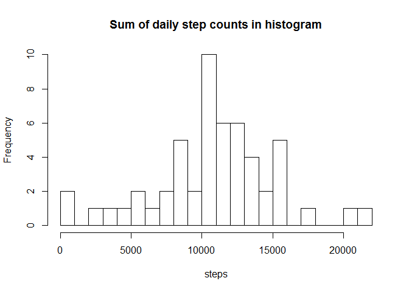

## Loading and preprocessing the data
-firstly to set a working directory and download repository RepData_PeerAssessment1, from my forked rep
-unzip the folder and check the files within
-reset the working directory to enter the unzipped folder to see files
-create myData object from .csv file

```r
setwd("~/ReproducibleResearch")
download.file(url="https://github.com/Matej85/RepData_PeerAssessment1/archive/master.zip",destfile = "RepData_PeerAssessment1.zip")
unzip(zipfile = "RepData_PeerAssessment1.zip")
list.files()
```

```
## [1] "PA1.Rmd"                        "PA1_template.Rmd"              
## [3] "RepData_PeerAssessment1-master" "RepData_PeerAssessment1.zip"   
## [5] "ReproResearchW1.html"           "ReproResearchW1.R"             
## [7] "ReproResearchW1.Rmd"            "Untitled.html"                 
## [9] "Untitled.Rmd"
```

```r
setwd("~/ReproducibleResearch/RepData_PeerAssessment1-master/")
myData<-read.csv(unzip("activity.zip"))
```


## What is mean total number of steps taken per day?

```r
# the user-defined function "TotalNumberData"" to process the data to dataframe suitable for mean/median calculation and plotting        
TotalNumberData<-function(x){
                # cleaning the dataset of NA values
                stepClean<-!is.na(x[1])
                        dataClean<-x[stepClean,]
                                # using tapply and sum function to have "per date" value
                                dataSum<-tapply(dataClean[,1],dataClean[,2],sum,na.rm=TRUE) 
                                        dateSumDF<-data.frame(dates=names(dataSum),steps=dataSum)
                                }
TotalNumberDF<-TotalNumberData(myData)  

#  plotting the hist 
with(TotalNumberDF,hist(steps,breaks = 20,freq = T,main = "Sum of daily step counts in histogram"))
```

<!-- -->

```r
# calculating mean and median values for the final statement
MeanValue<-mean(TotalNumberDF$steps,na.rm=TRUE)
MedianValue<-median(TotalNumberDF$steps,na.rm=TRUE)
```
The mean total number of steps taken per day equals to 1.0766189\times 10^{4}.
The median total number of steps taken per day equals to 10765. 

## What is the average daily activity pattern?

The "time.serieADJ" variable helps to plot the time serie on the graph. 
For that purpose need to convert variable "interval" to POSIXct time.
After the conversion to apply tapply+mean functions to create a dataframe "AveDayAct" with averaged 5minute 'through day' intervals and their step counts. 


```r
time <- substr(as.POSIXct(sprintf("%04.0f", myData$interval), format='%H%M'), 12, 16)
        myData$time<-time

AveDayAct<-tapply(myData$steps,myData$time,mean,na.rm=TRUE)
        AveDayAct<-data.frame(time.serie=names(AveDayAct),mean.steps=AveDayAct)
        
        AveDayAct$time.serieADJ<-as.POSIXct(as.character(AveDayAct$time.serie), format='%H:%M')
```

Plotting the task and calculating what time gives us the max.

```r
        plot(AveDayAct$time.serieADJ,AveDayAct$mean.steps,xlab="Time",ylab="Count of steps",
             main = "Averaged steps through a 5minute intervals in a day",type="l")
```

<!-- -->

```r
MaxVal<-max(AveDayAct$mean.steps)
        MaxVal<-as.character(AveDayAct[AveDayAct$mean.steps==MaxVal,1])
```

On average across all the days in the dataset, the time slot 08:35 indicates the maximum number of steps.

## Imputing missing values

###Total number of missing values in the dataset
Doing a bit of analysis to get an idea how NA rows with data look, 
through loop gaining a small dataset with variables "Date","Interval" showing how many values are affected by NA values within "Steps"

```r
        myDataNA<-myData[!complete.cases(myData),]
        dateNA<-unique(myDataNA[,2])
        
        intervalNumNA<-0
        dateNumNA<-NULL
        
                for(i in 1:length(dateNA)) {
                intervalNumNA[i]<-nrow(subset(myDataNA,myDataNA[,2]==unique(myDataNA[,2])[i],interval))
                dateNumNA[i]<-as.character(dateNA[i])
                }
        # checking on a number of NA rows in original dataset myData
        NArowsInterval<-nrow(myData)-nrow(myData[complete.cases(myData),])
        # reporting the analysis outputs
        NAreport<-data.frame(dateNumNA,intervalNumNA)
        table(NAreport)
```

```
##             intervalNumNA
## dateNumNA    288
##   2012-10-01   1
##   2012-10-08   1
##   2012-11-01   1
##   2012-11-04   1
##   2012-11-09   1
##   2012-11-10   1
##   2012-11-14   1
##   2012-11-30   1
```

```r
                NADateNum<-length(NAreport$dateNumNA)
```
The total number of missing values in the dataset equals to 2304.
The table shows there are 8 dates with NA "steps" values, each date's range from 0:00 to 23:55, as there is 288 unique cases for each.

###NA imputation using interval-mean variant via user-defined function and creating new dataset with imputed NA values

```r
# the function that defines options to impute NAs: date vs. interval, mean vs. median
        # NAimputeFUN is predefined function to calculate using interval-mean imputation of NAs
        NAimputeFUN<-function(impType="interval",impCalc="mean") {
                # to create new variable for the function purpose only
                myDataAdjust<-myData
                        # if...statement applied to differ the calculation for date vs. interval and mean vs. median
                        if (impType=="date") { 
                                # for impCalc variable used values calculated in task #1 MeanValue, MedianValue
                                ifelse(impCalc=="mean",calcFunc<-MeanValue,calcFunc<-MedianValue) 
                                myDataAdjust[is.na(myDataAdjust$steps),][,1]<-calcFunc        
                                
                        } else if (impType=="interval"){
                                        if (impCalc=="mean") {
                                                # gained mean values for interval imputation variant
                                                calcFunc<-tapply(myData$steps,myData$time,mean,na.rm=TRUE) 
                                        } else if (impCalc=="median") {
                                                        # gained median values for interval imputation variant
                                                        calcFunc<-tapply(myData$steps,myData$time,median,na.rm=TRUE) 
                                        } else {}
                                # NA imputation based on ordered time serie from 0 to 23:55
                                for(i in 1:length(unique(myDataAdjust$interval))) {                                   myDataAdjust[is.na(myDataAdjust$steps)&myDataAdjust[,3]==unique(myDataAdjust$interval[i]),][,1]<-calcFunc[i]
                                        }
                                        } else {} 
                
        myDataAdjust
        }
# new dataset called myDataAdjust with imputed values (interval-mean variant)
        myDataAdjust<-NAimputeFUN("interval","mean"); summary(myDataAdjust)
```

```
##      steps                date          interval          time          
##  Min.   :  0.00   2012-10-01:  288   Min.   :   0.0   Length:17568      
##  1st Qu.:  0.00   2012-10-02:  288   1st Qu.: 588.8   Class :character  
##  Median :  0.00   2012-10-03:  288   Median :1177.5   Mode  :character  
##  Mean   : 37.38   2012-10-04:  288   Mean   :1177.5                     
##  3rd Qu.: 27.00   2012-10-05:  288   3rd Qu.:1766.2                     
##  Max.   :806.00   2012-10-06:  288   Max.   :2355.0                     
##                   (Other)   :15840
```

###Histogram and median/mean calculation to compare between no impute - impute values
Making a histogram of the total number of steps taken each day, using function TotalNumberData to process the dataset

```r
        myDataAdjustDF<-TotalNumberData(myDataAdjust)
        #plotting the histogram
with(myDataAdjustDF,hist(steps,breaks = 20,freq = T,main = "Sum of daily step counts in histogram (imputated)"))
```

<!-- -->

```r
        # to calculate median/mean values for imputed dataset
        MeanValueIMP<-mean(myDataAdjustDF$steps,na.rm = TRUE)
        MedianValueIMP<-median(myDataAdjustDF$steps,na.rm = TRUE)
                MedianDiff<-MedianValueIMP-MedianValue
        # a new table showing the comparison
        FinalComp<-data.frame(Calculation=rep(c("median","mean"),2),
                              Process=rep(c("no impute","impute"),each=2),
                              Value=c(MedianValue,MeanValue,MedianValueIMP,MeanValueIMP))
```

To compare no-impute vs. impute values for median/mean, the 2panel plot is created.

```r
        par(mfrow = c(1, 2), mar = c(4, 4, 2, 1))       
        plot(subset(FinalComp, Calculation == "median")$Value, col = "green",type = "l",
             xlab="no impute vs. impute", ylab="median")
        plot(subset(FinalComp, Calculation == "mean")$Value, col = "blue",type = "l",
             xlab="no impute vs. impute", ylab="mean")
```

<!-- -->

The difference between no impute vs. impute can be seen for median value, there is an increase by 1.1886792. 
The mean value seems to keep the same level of 1.0766189\times 10^{4}. 
        
## Are there differences in activity patterns between weekdays and weekends?

Firstly, defining a new variable based on my native language words which mean Saturday/Sunday for weekend. After that process the dataset "myDataAdjust" to a frame suitable for plotting, mean value for each 5minute interval taking into account variable weekday vs. weekend
And lastly applying lattice package to get the plot. 

```r
myDataAdjust$weekDaysEnds<-as.factor(ifelse(weekdays(as.Date(myDataAdjust$date))%in% c("sobota","nede¾a"),"weekend","weekday"))

#applying package LATTICE
library(lattice)

#transform dataset "myDataAdjust"to a frame suitable for plotting
AveDayMyDataAdjust<-aggregate(myDataAdjust$steps,list(myDataAdjust$time,myDataAdjust$weekDaysEnds),mean,na.rm=TRUE)

# plotting the comparison        
xyplot(AveDayMyDataAdjust$x~as.factor(AveDayMyDataAdjust$Group.1)|AveDayMyDataAdjust$Group.2,
               data = AveDayMyDataAdjust,type="l",
               scales = list(x=list(at=seq(1,288,by=96),relation="free")), 
               xlab = "Interval",ylab = "Number of steps",main="Weekday vs. Weekend activity pattern comparison")
```

<!-- -->

From the plot above there is a difference around 08:00 for both of groups weekdays/weekends and also during afternoon hours. The plot logically confirms more activity in the morning for weekdays, more activity in the afternoon for weekends.
